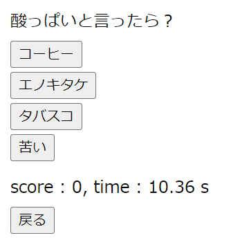

# MagicalBanana
1人向けマジカルバナナです。 
純粋なJavascriptへの理解を深めるため、敢えてJQueryを使用していません。

# 実行環境
- Windows10
EdgeとChromeで動作確認済み。
- Linux(Ubuntu)
Firefoxで動作確認済み。
- Android
Chromeだと動かない。他のブラウザは未検証。

# 実行方法
- MagicalBanana.htmlをブラウザで開く。

# 遊び方
- 「○○と言えば？」と聞かれるので、それに関連したものを選ぶ。
- 正解の場合は+1点、不正解の場合は-1点。
- 20点に達したらゲーム終了。かかった時間が表示される。

